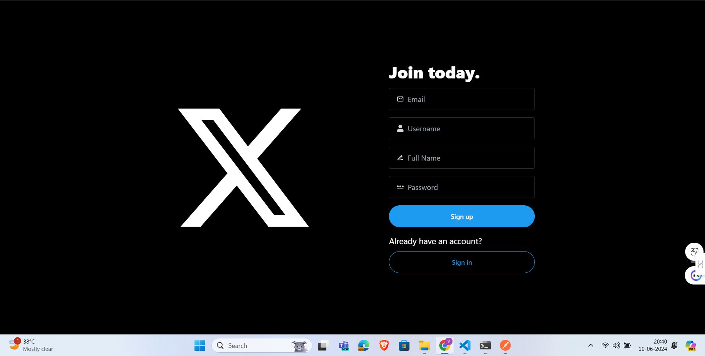
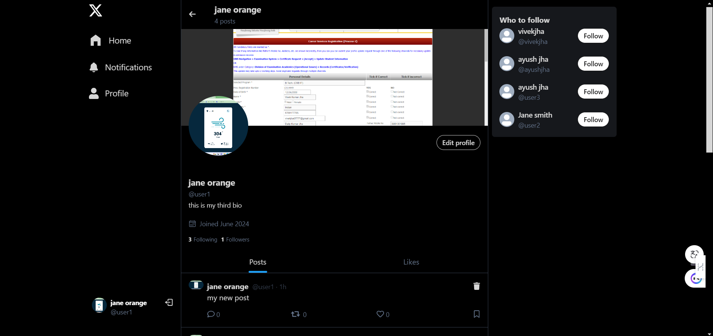

# TWITTER-CLONE

This is a Twitter clone project build using Node js express js mongo db and React

## Installation

1. Clone the repository:

   ```bash
   git clone https://github.com/VIVEKJHA7777/mini-twitter

2. Install dependencies:
   ``` bash
   npm install
   ```

### Set .env file
```
MONGODB_URI=
PORT = 
JWT_SECRET=
NODE_ENV= development
CLOUDINARY_CLOUD_NAME=
CLOUDINARY_API_KEY=
CLOUDINARY_API_SECRET=
```

### Start the app

```shell
npm run start
```

## Signup route

- **URL**: `http://localhost:8000/api/auth/signup`
- **Method**: `POST`
- **Description**: Handles user signup by validating input, hashing the password, creating a new user instance,
                  saving it to the database, generating a JWT token, and setting the token as a cookie in the 
                   response.

- **Request Body**:
  ```json
   {
	"fullName":"john Doe",
	"email":"johnDoe123@gmail.com",
	"password":"123",
	"username":"user1",
   }
  ```
- **Response**: 
  - Status: `201 Created`
  - Body:
```json
    {
    "_id": "666713d3aa4c7aed5f48ef5f",
    "fullName": "ayush jha",
    "username": "user3",
    "email": "user1jha@email.com",
    "follower": [],
    "following": [],
    "profileImg": "",
    "coverImg": ""
   }
   ```

## Login route

- **URL**: `http://localhost:8000/api/auth/login`
- **Method**: `POST`
- **Description**: Manages user login by finding the user with the provided email, validating the password, generating a JWT token, and setting the token as a 
cookie in the response.

- **Request Body**:
  ```json
   {
	"username":"johnDoe123@gmail.com",
	"password":"123456"
   }
  ```
- **Response**: 
  - Status: `200 Created`
  - Body:
```json
   {
    "_id": "6665c2fc0ae4f7a637847693",
    "fullName": "jane orange",
    "username": "user1",
    "email": "user1@example.com",
    "follower": [
        "6665c4030ae4f7a637847697"
    ],
    "following": [
        "66641675e308ef0f85c3f312",
        "6665c2040ae4f7a63784768f",
        "6665c0010ae4f7a637847687"
    ],
    "profileImg": "https://res.cloudinary.com/dzzzoik5q/image/upload/v1718019191/eym3wi7abz7jo0iw3khj.png",
    "coverImg": "https://res.cloudinary.com/dzzzoik5q/image/upload/v1718021836/np28rulbeje6vyg8gxwp.png"
    }
   ```

## Logout route

- **URL**: `http://localhost:8000/api/auth/logout`
- **Method**: `POST`
- **Description**: `Handles user logout by finding the user with the authenticated user ID, clearing the JWT cookie from the response to invalidate the session.`


- **Testing**:
  - Open Postman and navigate to the "API Keys" section.
  - pass the jwt token in the API key you will get token when you login with the user


- **Content-Type**: `application/json`
- **Authorization**: Bearer <your_JWT_token>

- **Response**: 
  - Status: `200 Created`
  - Body:
```json
   {
    "message": "Logged out successfully"
    }
 ```

 ### Routes 

## user Routes

1. Follow Route:- http://localhost:8000/api/users/follow/6665c4030ae4f7a637847697

2. Profile Route:- http://localhost:8000/api/users/profile/johndoe

3. Suggested User Route for Sidebar:- http://localhost:8000/api/users/suggested

4. Update Profile Route :- http://localhost:8000/api/users/update

## Posts Route

1. Create post Route:- http://localhost:8000/api/posts/create

2. Delete post Route:- http://localhost:8000/api/posts/:id

3. Comment on Post Route:-http://localhost:8000/api/posts/comment/:id

4. Like/Unlike post Route:- http://localhost:8000/api/posts/like/:id

5. Get All posts Route:-http://localhost:8000/api/posts/all

6. Get Liked Posts Route:-http://localhost:8000/api/posts/likes/:id

7. Get Following Post Route:- http://localhost:8000/api/posts/following

8. Get User Post Route:- http://localhost:8000/api/posts/user/:username


## ScreenShots

* Signup page



* Login page


* Home page


* profile page



* Notification Page


